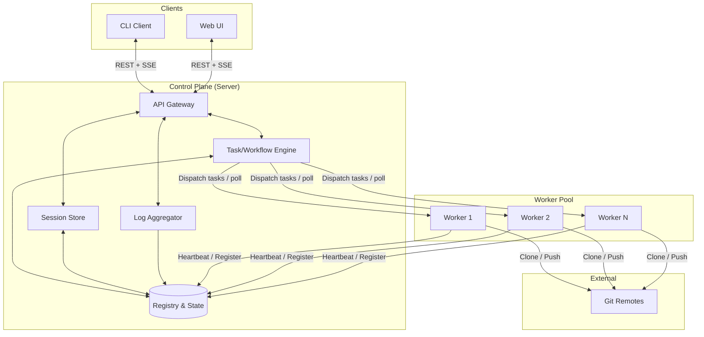
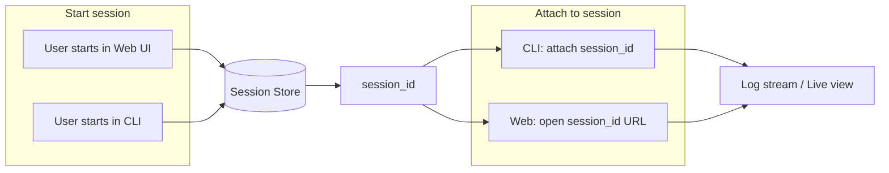
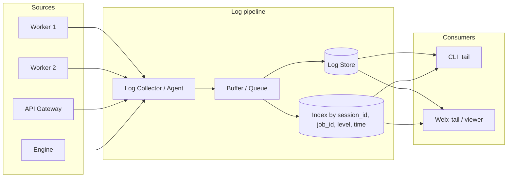
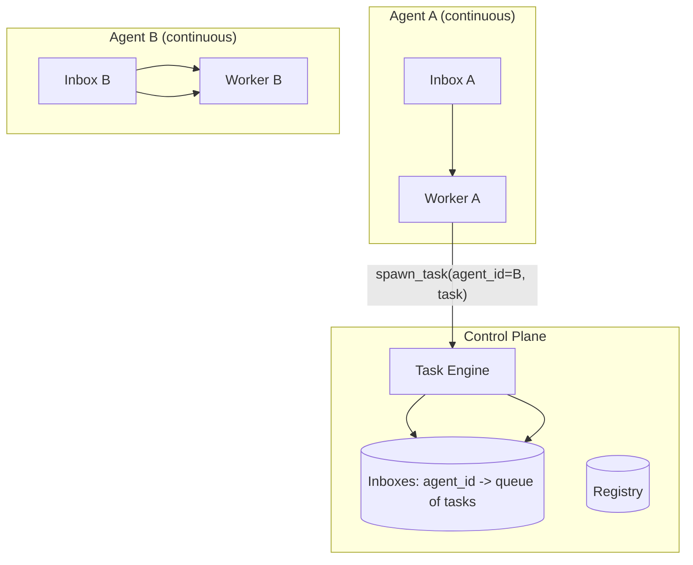

# Architecture & Communications

## 1. High-Level System Architecture

```
┌─────────────────────────────────────────────────────────────────────────────────┐
│                              CONTROL PLANE (Server)                               │
│  ┌─────────────┐  ┌──────────────┐  ┌─────────────┐  ┌─────────────┐            │
│  │ API Gateway │  │ Task/Workflow│  │  Session    │  │   Log       │            │
│  │ (REST+SSE)  │  │   Engine     │  │   Store     │  │   Aggregator│            │
│  └──────┬──────┘  └──────┬───────┘  └──────┬──────┘  └──────┬──────┘            │
│         │                 │                 │                 │                   │
│         └─────────────────┴────────┬───────┴─────────────────┘                   │
│                                    │                                              │
│  ┌─────────────────────────────────▼─────────────────────────────────────────┐   │
│  │                    Registry & State (Workers, Repos, Jobs, Inboxes)        │   │
│  │                    (DB: registry, sessions, task queue, inboxes)            │   │
│  └──────────────────────────────────────────────────────────────────────────┘   │
└─────────────────────────────────────────────────────────────────────────────────┘
         │                           │                            │
         │  REST + SSE               │  Task dispatch / heartbeats │  Log / SSE stream
         ▼                           ▼                            ▼
┌─────────────────┐    ┌─────────────────────────────────────────────────────────┐
│  CLI Client     │    │                    WORKER POOL                             │
│  (any machine)  │    │  ┌──────────┐  ┌──────────┐  ┌──────────┐  (auto-discover)│
└─────────────────┘    │  │ Worker A │  │ Worker B │  │ Worker N │                 │
         │             │  │ (device 1)│  │ (device 2)│  │ (device N)│                 │
         │             │  └────┬─────┘  └────┬─────┘  └────┬─────┘                 │
         │             │       │ clone/run   │              │                       │
         │             │       ▼             ▼              ▼                       │
         │             │  ┌─────────────────────────────────────┐                  │
         │             │  │  Git repos (local clones), Claude Code / Cursor CLI │   │
         │             │  └─────────────────────────────────────┘                  │
         │             └─────────────────────────────────────────────────────────┘
         │
         ▼
┌─────────────────┐
│  Web UI         │
│  (browser)      │
└─────────────────┘
```

## 2. Component Diagram (Mermaid)



### 2a. Schema migrations

**Where migrations run:** On **control plane startup**, not as a separate Docker Compose step. After connecting to Postgres, the server binary runs embedded SQLx migrations (`crates/server/migrations`) via `sqlx::migrate!(...).run(...)` in `crates/server/src/main.rs`, then binds the HTTP listener. Compose only ensures **`postgres` is healthy** before starting **`server`**; the first server process applies any pending migrations.

**Why not a dedicated `migrate` service in compose?** A single entrypoint keeps dev and prod behavior aligned: one image, one startup sequence. SQLx coordinates concurrent migrators with a database lock, so multiple server replicas (if you scale later) are safe for migrations.

**Operational note:** Changing migration files after they have been applied to a database causes checksum errors (`VersionMismatch`); use forward-only migrations in shared environments. Local Docker: reset the volume if needed (`docker compose down -v`). See [TROUBLESHOOTING.md](TROUBLESHOOTING.md#1b-versionmismatch--sqlx-migration-checksum-errors).

## 3. Worker Discovery & Registration

Workers **auto-discover** the control plane and register themselves so you can add new workers without reconfiguring the server.

```mermaid
sequenceDiagram
    participant W as New Worker
    participant R as Registry
    participant E as Task Engine

    W->>R: Register (id, capabilities, host, labels)
    R->>R: Add to worker pool
    loop Periodically
        W->>R: Heartbeat (status, current job id)
        R->>R: Update last_seen, mark stale if missing
    end
    Note over E,R: v1: no label/capability dispatch—see Product O4
    W->>E: Poll pull task (POST /workers/tasks/pull)
    E->>R: Claim pending job; bind to this worker if available
    R->>E: Job payload (or empty)
    E->>W: Task in pull response (same logical assign)
```

**Dispatch model:** v1 workers **poll** for work (`pull_task`); the engine does not push assignments over a standing connection. The diagram above is **logical**: assignment happens when a worker pulls and the server selects a job. **Capability/label matching** for dispatch is **not** in v1 ([PRODUCT.md — F2](PRODUCT.md#core-platform), [API_OVERVIEW — Register](API_OVERVIEW.md#register)); labels are for observability and future dispatch ([PRODUCT.md — O4](PRODUCT.md#optional--later)).

**Discovery:** Workers use an **explicit server URL** in env or config (`CONTROL_PLANE_URL`, plus auth). On startup they register with the control plane and then send **periodic heartbeats** via `POST /workers/:id/heartbeat`. The **heartbeat interval** is worker-configurable (e.g. 30s in env or config). The control plane updates last-seen on each heartbeat and marks a worker **stale** if no heartbeat is received for a **server-configured** threshold (e.g. 90s or 3× heartbeat interval). Stale workers are not assigned new tasks. There is no mDNS or broker-based discovery; workers always configure the URL explicitly.

### 3b. Worker death, job reclaim, and bounded retries

Workers can exit unexpectedly (panic, OOM, SIGKILL, host sleep/reboot). This section describes how the system **detects** dead workers, **reclaims** their jobs, and **bounds** retries so pathological jobs don't loop forever.

#### Identifying dead workers

The **primary signal** is heartbeat staleness:

- Each worker sends heartbeats on a configurable interval (e.g. 30s). The control plane stores `last_seen_at`.
- If `now - last_seen_at > worker_stale_seconds` (e.g. 90s), the worker is **stale**.
- Stale does not prove the OS is off -- it proves we have not heard from the process. Causes: crash, sleep, network loss, user killed the worker.

**No separate "dead" flag is required.** Stale is sufficient to treat the worker as unavailable for assignment and to reclaim its jobs.

We do **not** rely on:

- Worker-reported "I'm shutting down" (best-effort only; not required for correctness).
- TCP connection liveness to the worker (workers poll outbound; there is no persistent server-to-worker connection).

**Lease timeout (phase 2, implemented):** If a job stays `assigned` longer than `job_lease_seconds` (config, e.g. 21600 = 6h) even while the worker heartbeats, the server fails it with `[JOB_LEASE_EXPIRED]` as a "stuck job" escape hatch for hung agent CLIs or infinite loops. Default 0 = disabled. The server stores `jobs.assigned_at` when assigning; in `pull_task` (before stale reclaim) it runs lease reclaim when `job_lease_seconds > 0`.

#### Reclaiming tasks and reallocating

**When to reclaim (recommended: in `pull_task`):** Before selecting work, run a single transactional step:

```sql
UPDATE jobs
SET worker_id = NULL, status = 'pending', reclaim_count = reclaim_count + 1
WHERE status = 'assigned'
  AND worker_id IN (SELECT id FROM workers WHERE last_seen_at < $stale_cutoff)
  AND reclaim_count < $max_job_reclaims;
```

Jobs over the reclaim cap are failed instead (see below). Then proceed as normal: select from `status = 'pending'`.

**Reallocation:** After reclaim, jobs are `pending` with `worker_id = NULL`. The next `pull_task` from any non-stale worker may receive the job (existing selection rules apply).

**Idempotency:** Agent workflows should be designed so a second run after reclaim is acceptable (fresh clone, new branch, or explicit "continue" semantics in params). Document for users.

**Interaction with worker delete:** On `DELETE /workers/:id`, jobs assigned to that worker must also return to `pending` (and increment `reclaim_count`).

#### Bounded retries: stop reclaiming eventually

The retry loop to bound is: job assigned -> worker dies/sleeps before complete -> reclaimed -> another worker -> dies again. (This is distinct from agent failures, which go through `task_complete` with a failed status.)

- **`reclaim_count`** (integer, default 0) on the `jobs` table tracks how many times a job has been reclaimed from a stale worker.
- **`max_job_reclaims`** (config, e.g. **3**): when `reclaim_count >= max_job_reclaims`, the job is marked **`failed`** (not reclaimed); `error_message` is appended with `[MAX_WORKER_LOSS_RETRIES]` so UI/CLI can show a user-friendly explanation.
- **New job = fresh counter.** Operator "retry" creates a new job row; `reclaim_count` starts at 0.
- **Distinct from agent failure:** Agent returned non-zero / `task_complete` failed is existing behavior and does not increment `reclaim_count`. Two different failure modes, two different caps.

#### Visibility

- Log or metrics: `job_reclaimed{reason="stale_worker"}`.
- API/UI: `reclaim_count` or "reassigned after worker loss" on job/session detail.
- Failed reason `max_worker_loss_retries` visible in session/job views.

#### Configuration summary

| Key | Example | Purpose |
|-----|---------|---------|
| `worker_stale_seconds` | 90 | Worker considered dead for assignment + reclaim |
| `max_job_reclaims` | 3 | After N stale reclaims, fail job instead of retrying |
| `job_lease_seconds` (phase 2) | 0 (disabled) or e.g. 21600 | Max wall time in `assigned` before job is failed with `[JOB_LEASE_EXPIRED]`; 0 = no lease reclaim |

### 3c. Worker restart policy and host sleep

Workers run on **general workstations** that may sleep. The system handles two distinct failure modes differently:

- **Process crash while host is awake:** Handled by **OS-level restart policy** (Docker `restart: unless-stopped`, systemd `Restart=on-failure`, launchd `KeepAlive`). The restarted worker re-registers and picks up reclaimed jobs.
- **Host sleeps or powers off:** Restart policy does not help (the entire OS is suspended). Handled by **stale detection + job reclaim** (above). When the host wakes, the worker process resumes (Docker containers resume with the VM/host) and heartbeats again.

**Docker Compose is the recommended runtime** for consumer devices (developer laptops, desktops). See [Hosting](HOSTING.md#6-recommended-runtime-docker-compose) for the full rationale and detailed sleep/wake behavior per platform.

| Deployment target | Recommended runtime |
|-------------------|---------------------|
| Developer laptop / desktop (sleeps) | **Docker Compose** -- lightweight, crash restart, sleep-compatible |
| Dedicated server / VPS (always-on) | Docker Compose or K8s |
| Cloud / EKS / GKE | K8s |
| Dev "just run it" | `cargo run` in terminal |

**Panic reduction:** Run workers under a supervisor with restart backoff (Docker `restart`, systemd, launchd); keep worker logs on disk for post-mortems. Prefer fixing panics in the worker binary over relying on restart alone ([HOSTING.md §11 Anti-patterns](HOSTING.md#11-anti-patterns)).

## 4. Task & Workflow Execution Flow

```mermaid
sequenceDiagram
    participant U as User (CLI or Web)
    participant API as API Gateway
    participant E as Task Engine
    participant R as Registry
    participant W as Worker

    U->>API: Create session / Start workflow (repo, type, params)
    API->>E: Enqueue or assign
    E->>R: Select worker (available, capable)
    E->>W: Dispatch (clone url, workflow def, env)
    W->>W: Clone repo, run Claude Code / Cursor CLI (user’s token)
    W->>API: POST log batches; control plane aggregates (see §6)
    API->>U: Stream logs to CLI or Web
    W->>E: Task complete (result, branch, commit ref)
    E->>R: Update job state
    E->>API: Notify session complete
```

**v1:** Workers get tasks by **polling** (e.g. `POST /workers/tasks/pull` or long-poll); the engine does not push. When a worker polls, the engine selects an available worker and returns the task (logically "dispatch" as above).

**Workflow types and how they map:**

- **Chat** → Multi-turn in one session: the first job uses the create-session prompt; each follow-up via `POST /sessions/:id/input` is a new job whose **`task_input`** includes the original prompt (`session_prompt`), prior user follow-ups (`history`), prior assistant replies (`history_assistant`; user/assistant text only, no thinking or tool calls), and the new message—so the agent sees the full conversation and session goal (e.g. “Retry”). **Bounded payload:** The control plane **must not** grow `history` / `history_assistant` without limit—defaults and `history_truncated` are specified in [API_OVERVIEW — Pull task](API_OVERVIEW.md#pull-task). UI copy: [CLIENT_EXPERIENCE §12](CLIENT_EXPERIENCE.md#12-long-chat-sessions).
- **Loop N times** → **One job per iteration:** the engine creates N jobs; each job is one task (one clone, one agent run). Worker pulls one task per iteration.
- **Loop until sentinel** → **One job per iteration:** worker runs until agent output contains the configured **literal substring** sentinel (**v1**; no regex); each iteration is one job. Variable number of jobs per session.
- **Continuous inbox** → Long-lived session per agent; tasks are messages in an inbox; worker **polls** the control plane (v1: no broker push).
- **Spawn to other inbox** → One workflow sends a message/task to another agent’s inbox (stored in Registry); that agent’s worker picks it up.

(One job per iteration is the rule for loop workflows.)

### 4b. Personas (separate agent identities)

When you have agent loops, inboxes, and chat, agents need **separate personas**—distinct “who is this agent” context for each run. Personas are **user-provided, pre-configured prompts** stored in the control plane (e.g. “Refactorer”, “Reviewer”, “Code reviewer that focuses on security”).

**At every invocation** (chat, loop iteration, inbox task, or any other path), the system:

1. Resolves the **persona** for that run (from session params, inbox config, or task payload).
2. Takes that persona’s prompt and **combines it with the task-specific information** (repo, ref, user message, loop prompt, inbox payload, etc.).
3. Passes that combined context to the worker; the worker invokes the Claude Code or Cursor CLI with it so the agent runs with the right identity and task.

So: the same worker and CLI can run many “agents”; what distinguishes them is the persona prompt plus the task. Personas are optional: if no persona is specified, the task runs with only the workflow params (e.g. a single user prompt). See [Product W6](PRODUCT.md) and [API_OVERVIEW](API_OVERVIEW.md) (Personas, persona_id in session/inbox). **Resolution order and CRUD edge cases:** [PHASE2_DESIGN.md §2](PHASE2_DESIGN.md#2-personas).

**Agent execution (BYOL):** The worker does not call model HTTP APIs for the main agent turn. It runs the **Claude Code** or **Cursor** CLI in the cloned repo, authenticated with the user’s **agent** token stored on the control plane (Web UI / CLI / API). Git identity OAuth applies to **GitHub/GitLab** only. See [Product: BYOL](PRODUCT.md#bring-your-own-licence-byol).

### 4c. Platform-specific workers (CLI invocation)

Workers run on **Windows** (native or WSL), **macOS**, and **Linux**. The agent CLIs (Claude Code, Cursor) **operate differently on each platform**—different invocation, argument passing, process model, and output streaming. A single “generic” worker that assumes Unix behaviour is not sufficient; in particular **Windows** diverges heavily (process creation, quoting, console/PTY, stdout/stderr handling).

We must have **platform-specific workers** (or platform-specific handling inside the worker) that implement, per platform:

1. **Discovering and invoking the CLI** — where the CLI is installed, how it is named, how to spawn it (e.g. `CreateProcess` vs `fork`/`exec`, WSL vs native Windows).
2. **Passing arguments in** — how to pass prompts, options, and task context into the CLI (argument quoting, command-line vs stdin, environment; Windows command-line parsing is different from Unix).
3. **Streaming results out** — how to capture and stream stdout/stderr (or equivalent) back to the control plane; PTY vs non-PTY, Windows console vs Unix streams.

So: **one worker binary (or build) per platform** (Windows native, WSL, macOS, Linux), each with **specific handling** for interacting with the CLIs on that platform. Workers **advertise their platform** (e.g. via labels such as `platform=windows`, `platform=wsl`, `platform=macos`, `platform=linux`) for observability (filtering, display).

**Operational requirement (slick multi-platform pools):** Run a **homogeneous worker pool** per deployment—same **OS family** (or WSL vs native Windows) and the same **`agent_cli` installed and on PATH**. The v1 engine does **not** enforce platform or CLI affinity; a mixed pool (e.g. Linux + macOS workers) can assign a task to a machine that **cannot** run the requested CLI. Prefer **separate control plane deployments** or a **single OS** in the pool until **label/capability dispatch** is available ([Product O4](PRODUCT.md)). See [Tech Stack §2](TECH_STACK.md#2-workers-rust) and [Product F2](PRODUCT.md).

**Implementation (CLI/Web):** The **Workers** view **must** implement the warning banner and messaging in [CLIENT_EXPERIENCE §10](CLIENT_EXPERIENCE.md#10-worker-pool-heterogeneity-warnings) when the registry shows **incompatible or mixed** `platform` labels so users are not surprised by spawn/CLI errors.

**Implementation (Rust worker):** `crates/worker/src/agent_cli/` provides `AgentCliRunner` (Unix vs Windows spawn options), `build_invocation` (`claude_code` \| `cursor` → argv + env + optional stdin; tokens only in env; **Cursor** always injects `-f` after the first argv token when missing—including when `REMOTE_HARNESS_CURSOR_AGENT_ARGS` overrides the default `run --print`; when `params.model` is set, **Cursor** also gets **`--model <name>`** on argv unless the env override already includes `--model`), `run_invocation` (stdout/stderr line streaming with redaction to log sinks + raw capture for `task_complete`), and WSL-aware `register_platform_label` (`wsl` \| `linux` \| `macos` \| `windows`). End-to-end **pull → clone → agent → commit/push → `POST` logs → `POST` complete** is implemented in `crates/worker/src/task_execution.rs` and driven from `crates/worker/src/lib.rs` (per-job work dir under `REMOTE_HARNESS_WORK_DIR`, heartbeats report **busy** with `current_job_id` while a job runs).

## 5. Session Attachment (CLI ↔ UI)

Sessions are stored in the **Session Store** and identified by a stable **session ID**. Both CLI and Web use the same API and session ID.



**Implementation notes:**

- Creating a session returns `session_id` (and optionally a deep link for the Web UI).
- **CLI**: `remote-harness attach <session_id>` opens a live view (logs, status) and optionally sends input (e.g. chat).
- **Web**: URL like `/sessions/:session_id` shows the same session; same log tail and controls.
- Both clients subscribe to the same **log stream** and **session events** via **SSE** keyed by `session_id`.

## 6. Logging Architecture



**Requirements:**

- **Structured logs** (e.g. JSON) with fields: `session_id`, `job_id`, `worker_id`, `level`, `message`, `timestamp`, `source`.
- **Logs interface: consistent and complete.** Wherever a user views logs (session, job, or any context), the **full history** for that context must be **loaded and rendered first** (all logs, no cap—paginate until complete), then the live stream is attached. So: (1) client fetches all existing logs for the context, (2) client renders them, (3) client subscribes to the stream so new logs append. The user always sees the complete backlog before any streamed entries; same behavior in CLI and Web UI.
- **Tail from CLI**: e.g. `remote-harness logs tail --session-id <id>` — load history first, then stream. v1: SSE for the stream.
- **Tail from Web**: Session (and job) detail views have a log panel that loads full history for that context first, then streams. **CLI and Web UI** both show **all logs from all places** (agent, system, backend, worker).
- **Persistence**: See “Observability and dual-write” below.

**Observability at all times — dual-write (files + central store):**

Logs must be findable even when something is broken (e.g. streaming to the CLI or Web UI fails). So every component **writes logs to local files** on the machine where it runs, and the same logs are also available from a **central store** so the CLI and Web UI can both show everything.

| Where | What happens |
|-------|----------------|
| **Worker** | Writes **all** logs (agent output, system, worker code) to **local files** on the worker machine (e.g. under a configured log dir). **Also** sends the same log entries to the control plane (HTTPS POST). So if the control plane or network is down, logs are still on disk on that worker. |
| **Control plane** | Writes its own logs to **local files** on the backend (e.g. under a configured log dir). Receives worker logs and stores them in the **central store** (DB). Writes its own logs into the same central store so the CLI and Web UI have one place for “all logs.” So if the stream or either client is broken, you can still read files on the backend (control plane’s own logs) and on each worker (that worker’s logs). |
| **Central store (DB)** | Holds all logs that reached the control plane (worker logs via POST, control plane’s own logs). Used for CLI and Web UI tail, search, and “whole system” view. Default retention: 7 days (configurable); “retain forever” / manual delete apply here. |
| **CLI and Web UI** | Both get all logs from the central store (tail API, search). So from either client you see agent, system, backend, worker — the whole state. If streaming or the client is broken, you fall back to reading **files on the backend** or **files on the worker**. |

So: **all logs go to disk** — every log line is written to local files on the component that produced it (control plane to files on the backend, each worker to files on that worker). The same logs (that reach the control plane) are also in the central store so the **CLI and Web UI** can show everything. Observability at all times from either client; if the stream or a client breaks, you always have logs on disk.

**Implementation note (v1 control plane):** The **Postgres central store** is implemented: worker batch ingest (`POST /workers/tasks/:id/logs`), paginated history, delete, and scheduled retention purge (honoring `retain_forever`). **SSE** live tail (`GET /sessions/:id/logs/stream`) and session lifecycle events (`GET /sessions/:id/events`) use in-memory broadcast channels (see [`SSE_EVENTS.md`](SSE_EVENTS.md)). **Optional on-server file mirroring** of ingested lines is not implemented—the operator path for “files when the UI breaks” remains **worker-local files** and **host logs** for the server process.

## 7. Agent Inboxes & Cross-Agent Tasks

For “agents monitoring an inbox” and “spawn tasks to another agent’s inbox”:



- Each **agent** (or agent “role”) has an **inbox** in the Registry (DB); tasks are rows in a table.
- A **continuous** workflow is a long-running worker that: (1) claims “inbox listener” for that agent, (2) **polls** the inbox via the API, (3) processes tasks and can call the API to **spawn_task(agent_id, payload)**.
- Spawn inserts a task into the target agent’s inbox; that agent’s worker picks it up when it polls or receives an event.

**Design detail (listener claim, promotion to `jobs`, cross-agent spawn authz):** [PHASE2_DESIGN.md §3](PHASE2_DESIGN.md#3-inboxes-and-cross-agent-tasks).

## 8. Three auth concerns

The system has **three separate auth concerns**. Do not mix them up:

| Concern | Who | Purpose | Who chooses the mechanism |
|--------|-----|---------|----------------------------|
| **1. Auth to the control plane** | User (CLI/Web UI) and worker process | Who is allowed to use this Remote Harness instance; which machines may register as workers. | **We** choose (e.g. API key, OIDC, mTLS). This is our API's auth. |
| **2. Auth to the Git provider** | User (via our app); worker uses the token we give it | Clone/push to GitHub/GitLab. Must work with that provider. | **The provider** (GitHub/GitLab). We store and refresh the user's token; we pass it to the worker per job. |
| **3. Auth to the agent CLI (BYOL)** | User (their subscription); worker runs CLI with that token | Claude Code / Cursor must be authenticated. | **The provider** (Claude Code, Cursor). We store and refresh the user's token; we pass it to the worker so it can run the CLI. |

- **Control plane auth (1)** is the only one we design ourselves. v1 uses **API key only** for CLI, Web UI, and workers; see [Tech Stack §6](TECH_STACK.md#6-security--auth-control-plane-only) for configuration. OIDC and mTLS are out of scope for v1.
- **Git (2)** and **agent CLI (3)** are always on behalf of the user and use **that provider's** mechanism; we do not replace it, we store and pass tokens.

## 9. Git Integration (Workers)

| Mode | Behavior |
|------|----------|
| **Main** | Worker clones, makes commits, pushes to `main` (or configured default branch). |
| **Task order (worker)** | Clone and checkout the session **ref** first (fail fast if URL/token/ref is wrong). Create a **placeholder** branch when required (`rh/job-<hex>` or `{branch_name_prefix}/job-<hex>` in **PR** mode), **run the main agent CLI**, then—if the working tree has changes—run a **second agent invocation** (same CLI + task credentials) that returns JSON: **branch slug** (3–5 words, path segment), **commit subject** (5–10 words), **commit body** (paragraphs or bullets). The worker renames the placeholder branch to `{prefix}/{slug}` when safe, commits with subject + body + correlation footer, and pushes. Set `REMOTE_HARNESS_SKIP_GIT_METADATA_AGENT=1` to skip the second call and use a deterministic fallback from task prompt + diff excerpt. Failures in rename/commit/push are user-visible (see [§9a](ARCHITECTURE.md#9a-when-the-worker-attempts-commit-and-push)). |
| **PR/MR** | Worker creates a branch (e.g. from prompt or naming rule), commits, pushes branch, optionally creates PR/MR via API (GitHub/GitLab). |

**Branch naming:** Default is derived from **session_id** (e.g. `harness/<short_session_id>`). Session create accepts optional **branch_name_prefix** in params; if set, branch = prefix + short session/task id. See [API_OVERVIEW](API_OVERVIEW.md).

### 9a. When the worker attempts commit and push

The worker **attempts** commit and push only after the **main agent run** completes in a way the worker treats as successful for Git follow-up (e.g. the agent process ran and the worker did not abort before the commit step—exact condition is implementation-defined but **must** be documented in worker release notes). If that precondition is not met, **no commit** is produced.

**Commit message:** After a successful **main** agent run, if there are local changes the worker runs a **metadata** agent step (unless skipped via env). The **subject** (first line, ≤72 characters) and **body** come from that step’s JSON when parseable; otherwise they are derived from the task prompt and a **diff excerpt** (deterministic fallback). A final line block records `workflow` and short `session_id` / `job_id` prefixes for correlation (`remote-harness: workflow=…`). **Branch names** on synthetic placeholder branches are replaced with `{branch_name_prefix}/{slug}` from the same metadata (with collision disambiguation); work on a user’s existing branch (non-placeholder) is committed there without renaming.

**Typical reasons there is no commit or push:**

| Cause | Result | What to check |
|---------|--------|----------------|
| **Agent run failed early** (e.g. CLI missing, spawn error, timeout) | Job **failed**; often no `branch` / `commit_ref`. | `error_message`, worker logs: agent run / spawn errors. |
| **Missing task credentials** | No clone; job **failed**. | Identity or params must supply `repo_url`, `git_token`, `agent_cli`, `agent_token`. |
| **Clone or checkout failed** | Job **failed**; auth or ref issues. | `error_message`, [GIT_CLONE_SPEC.md](GIT_CLONE_SPEC.md). |
| **Git metadata step** (second agent call) parse/invoke failure | Worker **falls back** to deterministic subject/body from task + diff; job continues unless rename/commit/push fails. | Worker logs warn on parse failure; set `REMOTE_HARNESS_SKIP_GIT_METADATA_AGENT=1` to force fallback only. |
| **Branch rename** (placeholder → final slug) failed | Job **failed** after agent succeeded. | `error_message` names rename; worker logs. |
| **Create branch failed** | Job **failed**. | Worker logs, `error_message`. |
| **Commit or push failed** after agent ran | May have **no** `commit_ref` even if the agent produced output; job status depends on agent exit code and worker policy. | Logs for push/auth errors. |

**Edge case:** Some implementations still **attempt** commit/push after the agent exits **non-zero** (agent “failed” but worker proceeded). Then you can have **commits on the remote** while the job **`status`** is **failed**—the control plane will not open a PR/MR unless it only does so on **success** ([§9b](ARCHITECTURE.md#9b-when-the-control-plane-creates-a-prmr)). UI must explain that distinction ([CLIENT_EXPERIENCE §8](CLIENT_EXPERIENCE.md#8-git-commit-push-and-prmr-outcomes)).

### 9b. When the control plane creates a PR/MR

The server creates a **Pull Request (GitHub)** or **Merge Request (GitLab)** only when **all** of the following hold (exact handler is implementation-specific; these are the intended product rules):

- Task complete reports **success** (not **failed**).
- Job reaches a **completed** (or equivalent) terminal state aligned with that success.
- **`branch`** and **`mr_title`** (or API equivalent) from the worker are **non-empty** where required by the API contract.
- Session **`params.branch_mode`** is **`"pr"`** (exact string).
- **`repo_url`** is recognized as **GitHub or GitLab**, and the identity has a **git token** usable for the provider API.

**Typical reasons there is no PR/MR despite a push:**

| Cause | What to check |
|-------|----------------|
| **Job not successful** | Worker sent `failed` (e.g. agent non-zero). MR logic usually requires success. |
| **Not in PR mode** | `branch_mode` must be `"pr"`. |
| **Missing branch or title** | Task complete payload incomplete. |
| **Provider not GitHub/GitLab** | URL not recognized; MR skipped. |
| **Provider API error** | Token scopes, rate limits, or API failure—job may still **complete** while MR creation fails; surface for operators ([CLIENT_EXPERIENCE §8](CLIENT_EXPERIENCE.md#8-git-commit-push-and-prmr-outcomes)). |

Operator checklist: [TROUBLESHOOTING §2b](TROUBLESHOOTING.md#2b-no-commit-push-or-merge-request).

**Provider matrix, token scopes, optional `pull_request_error` on jobs:** [PHASE2_DESIGN.md §4](PHASE2_DESIGN.md#4-prmr-creation-o2).

### Git auth (GitHub / GitLab) — auth concern 2

Git operations must work with **GitHub** and **GitLab**. This is **auth concern 2** (see §8): the provider’s mechanism; we store and pass the user’s token. Workers never perform login themselves.

- **User sign-in:** Users sign in to GitHub and/or GitLab via the platform (e.g. OAuth in the Web UI or CLI). The **control plane** stores and refreshes tokens (OAuth refresh or PAT) as appropriate.
- **Credentials per job:** For each task, the control plane either includes a job-scoped token in the task payload or exposes an endpoint so the worker can request credentials for a given repo. Workers use that token only for the duration of the job.
- **Worker Git usage:** The worker receives a token (or SSH key) and uses it for clone/push. Both GitHub and GitLab support HTTPS with a token as the password; the worker’s Git library (e.g. `git2`) is configured with credentials we supply—no reliance on the host’s global Git config for user credentials. To avoid libgit2 "too many redirects or authentication replays" (e.g. on HTTP→HTTPS or CDN redirects), the worker must embed the token in the URL (URL-encoded) and set follow_redirects to All; see [GIT_CLONE_SPEC.md](GIT_CLONE_SPEC.md).

## 10. Deployment Topology (Logical)

- **Single server**: Control plane (API + Engine + Session Store + Log Aggregator + Registry) on one host; workers on one or many devices.
- **Scaled**: API and Engine can be replicated behind a load balancer; Registry and Log Store must be shared (DB, queue, or distributed store).
- **Control plane & workers**: Implemented in Rust (see [Tech Stack](TECH_STACK.md)). Workers run on dev machines, CI nodes, or dedicated boxes; only need network access to control plane and Git remotes.

**Hosting flexibility:** The control plane (and its DB) can run on an always-on server or on a sleepable machine (e.g. desktop or laptop). Workers can run on Windows (native or WSL), macOS, or Linux. For **power-saving setups** where the backend and workers may be off or asleep, an optional **wake integration** (configurable URL or script invoked by the UI/CLI) lets you trigger your own wake path (e.g. WOL from an always-on host). The product does not mandate or implement WOL or any specific hosting layout. See [Hosting](HOSTING.md) for deployment topologies and the sleepable / wake-integration design.

---

*Next: [Tech Stack](TECH_STACK.md) | [Product & Features](PRODUCT.md) | [Hosting](HOSTING.md) | [Client experience](CLIENT_EXPERIENCE.md)*
