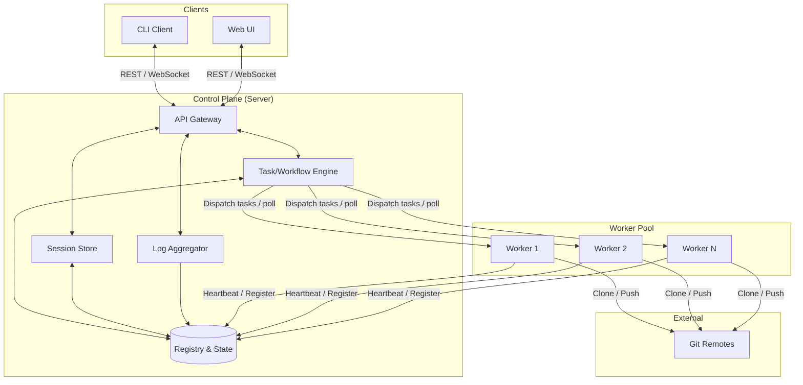
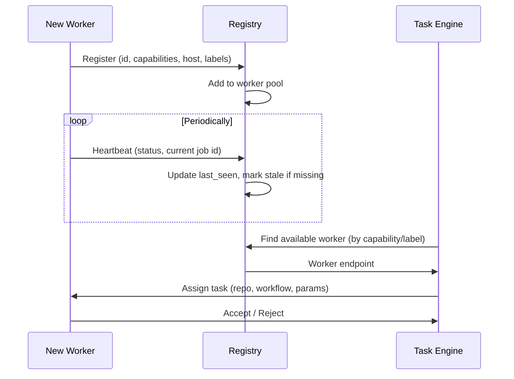
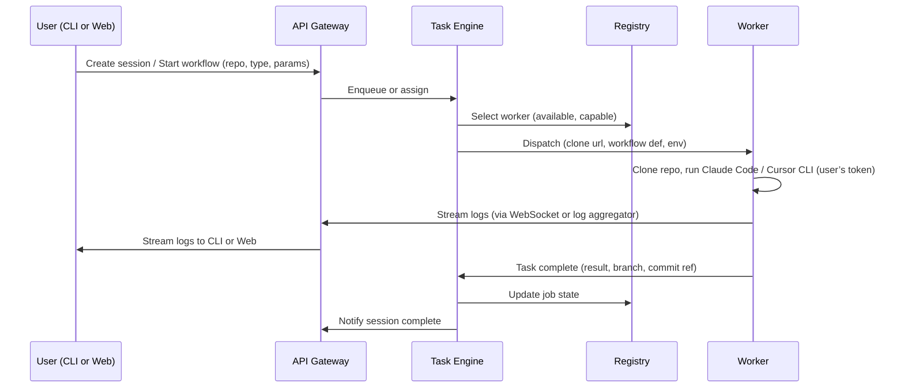
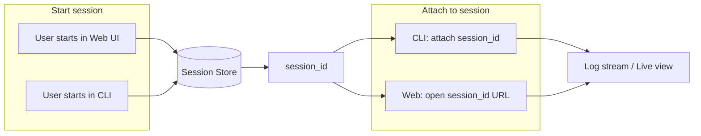
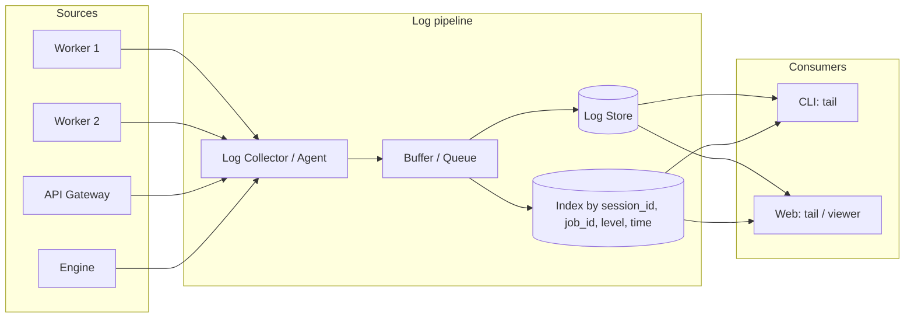
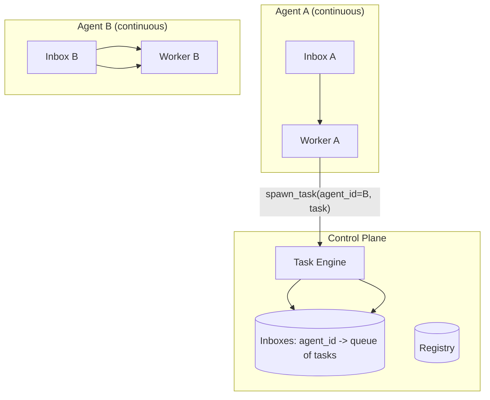

# Architecture & Communications

## 1. High-Level System Architecture

```
┌─────────────────────────────────────────────────────────────────────────────────┐
│                              CONTROL PLANE (Server)                               │
│  ┌─────────────┐  ┌──────────────┐  ┌─────────────┐  ┌─────────────┐            │
│  │ API Gateway │  │ Task/Workflow│  │  Session    │  │   Log       │            │
│  │ (REST/WS)   │  │   Engine     │  │   Store     │  │   Aggregator│            │
│  └──────┬──────┘  └──────┬───────┘  └──────┬──────┘  └──────┬──────┘            │
│         │                 │                 │                 │                   │
│         └─────────────────┴────────┬───────┴─────────────────┘                   │
│                                    │                                              │
│  ┌─────────────────────────────────▼─────────────────────────────────────────┐   │
│  │                    Registry & State (Workers, Repos, Jobs, Inboxes)        │   │
│  │                    (DB: registry, sessions, task queue, inboxes)            │   │
│  └──────────────────────────────────────────────────────────────────────────┘   │
└─────────────────────────────────────────────────────────────────────────────────┘
         │                           │                            │
         │  REST/WebSocket           │  Task dispatch / heartbeats │  Log stream
         ▼                           ▼                            ▼
┌─────────────────┐    ┌─────────────────────────────────────────────────────────┐
│  CLI Client     │    │                    WORKER POOL                             │
│  (any machine)  │    │  ┌──────────┐  ┌──────────┐  ┌──────────┐  (auto-discover)│
└─────────────────┘    │  │ Worker A │  │ Worker B │  │ Worker N │                 │
         │             │  │ (device 1)│  │ (device 2)│  │ (device N)│                 │
         │             │  └────┬─────┘  └────┬─────┘  └────┬─────┘                 │
         │             │       │ clone/run   │              │                       │
         │             │       ▼             ▼              ▼                       │
         │             │  ┌─────────────────────────────────────┐                  │
         │             │  │  Git repos (local clones), Claude Code / Cursor CLI │   │
         │             │  └─────────────────────────────────────┘                  │
         │             └─────────────────────────────────────────────────────────┘
         │
         ▼
┌─────────────────┐
│  Web UI         │
│  (browser)      │
└─────────────────┘
```

## 2. Component Diagram (Mermaid)



## 3. Worker Discovery & Registration

Workers **auto-discover** the control plane and register themselves so you can add new workers without reconfiguring the server.



**Discovery:** Workers use an **explicit server URL** in env or config (`CONTROL_PLANE_URL`, plus auth). On startup they register with the control plane and then send **periodic heartbeats** via `POST /workers/:id/heartbeat`. The **heartbeat interval** is worker-configured (e.g. 30s in env or config). The control plane updates last-seen on each heartbeat and marks a worker **stale** if no heartbeat is received for a **server-configured** threshold (e.g. 90s or 3× heartbeat interval). Stale workers are not assigned new tasks. See [Decisions §13](DECISIONS.md#13-worker-heartbeat-interval-and-stale-threshold). There is no mDNS or broker-based discovery; workers always configure the URL explicitly.

## 4. Task & Workflow Execution Flow



**v1:** Workers get tasks by **polling** (e.g. `POST /workers/tasks/pull` or long-poll); the engine does not push. When a worker polls, the engine selects an available worker and returns the task (logically "dispatch" as above).

**Workflow types and how they map:**

- **Chat** → Single run or multi-turn in one session (user sends messages via `POST /sessions/:id/input`). See [Decisions §15](DECISIONS.md#15-multi-turn-chat-in-v1).
- **Loop N times** → **One job per iteration:** the engine creates N jobs; each job is one task (one clone, one agent run). Worker pulls one task per iteration.
- **Loop until sentinel** → **One job per iteration:** worker runs until agent output matches the sentinel; each iteration is one job. Variable number of jobs per session.
- **Continuous inbox** → Long-lived session per agent; tasks are messages in an inbox; worker polls or receives via queue.
- **Spawn to other inbox** → One workflow sends a message/task to another agent’s inbox (stored in Registry); that agent’s worker picks it up.

See [Decisions §14](DECISIONS.md#14-job-granularity-for-loop-workflows) for job-per-iteration.

### 4b. Personas (separate agent identities)

When you have agent loops, inboxes, and chat, agents need **separate personas**—distinct “who is this agent” context for each run. Personas are **user-provided, pre-configured prompts** stored in the control plane (e.g. “Refactorer”, “Reviewer”, “Code reviewer that focuses on security”).

**At every invocation** (chat, loop iteration, inbox task, or any other path), the system:

1. Resolves the **persona** for that run (from session params, inbox config, or task payload).
2. Takes that persona’s prompt and **combines it with the task-specific information** (repo, ref, user message, loop prompt, inbox payload, etc.).
3. Passes that combined context to the worker; the worker invokes the Claude Code or Cursor CLI with it so the agent runs with the right identity and task.

So: the same worker and CLI can run many “agents”; what distinguishes them is the persona prompt plus the task. Personas are optional: if no persona is specified, the task runs with only the workflow params (e.g. a single user prompt). See [Product W6](PRODUCT.md), [API_OVERVIEW](API_OVERVIEW.md) (Personas, and persona_id in session/inbox), and [Decisions §23](DECISIONS.md#23-personas).

**Agent execution (BYOL):** The worker does not call any AI APIs directly. It runs the **Claude Code** or **Cursor** CLI in the cloned repo, authenticated with the user’s token (obtained when the user signs in via OAuth with Claude Code or Cursor — same for Web UI and CLI). The platform stores and refreshes that token; execution is bring-your-own-licence. See [Product: BYOL](PRODUCT.md#bring-your-own-licence-byol).

### 4c. Platform-specific workers (CLI invocation)

Workers run on **Windows** (native or WSL), **macOS**, and **Linux**. The agent CLIs (Claude Code, Cursor) **operate differently on each platform**—different invocation, argument passing, process model, and output streaming. A single “generic” worker that assumes Unix behaviour is not sufficient; in particular **Windows** diverges heavily (process creation, quoting, console/PTY, stdout/stderr handling).

We must have **platform-specific workers** (or platform-specific handling inside the worker) that implement, per platform:

1. **Discovering and invoking the CLI** — where the CLI is installed, how it is named, how to spawn it (e.g. `CreateProcess` vs `fork`/`exec`, WSL vs native Windows).
2. **Passing arguments in** — how to pass prompts, options, and task context into the CLI (argument quoting, command-line vs stdin, environment; Windows command-line parsing is different from Unix).
3. **Streaming results out** — how to capture and stream stdout/stderr (or equivalent) back to the control plane; PTY vs non-PTY, Windows console vs Unix streams.

So: **one worker binary (or build) per platform** (Windows native, WSL, macOS, Linux), each with **specific handling** for interacting with the CLIs on that platform. Workers **advertise their platform** (e.g. via labels such as `platform=windows`, `platform=wsl`, `platform=macos`, `platform=linux`) for observability (filtering, display). **v1: no platform affinity** — the engine assigns tasks to any available worker; it does not prefer or require a matching platform. See [Decisions §29](DECISIONS.md#29-platform-affinity-v1). See [Tech Stack §2](TECH_STACK.md#2-workers-rust), [Product F2](PRODUCT.md), and [Decisions §25](DECISIONS.md#25-platform-specific-workers-cli-invocation).

## 5. Session Attachment (CLI ↔ UI)

Sessions are stored in the **Session Store** and identified by a stable **session ID**. Both CLI and Web use the same API and session ID.



**Implementation notes:**

- Creating a session returns `session_id` (and optionally a deep link for the Web UI).
- **CLI**: `remote-harness attach <session_id>` opens a live view (logs, status) and optionally sends input (e.g. chat).
- **Web**: URL like `/sessions/:session_id` shows the same session; same log tail and controls.
- Both clients subscribe to the same **log stream** and **session events** via **SSE** keyed by `session_id`.

## 6. Logging Architecture



**Requirements:**

- **Structured logs** (e.g. JSON) with fields: `session_id`, `job_id`, `worker_id`, `level`, `message`, `timestamp`, `source`.
- **Logs interface: consistent and complete.** Wherever a user views logs (session, job, or any context), the **full history** for that context must be **loaded and rendered first** (all logs, no cap—paginate until complete), then the live stream is attached. So: (1) client fetches all existing logs for the context, (2) client renders them, (3) client subscribes to the stream so new logs append. The user always sees the complete backlog before any streamed entries; same behavior in CLI and Web UI. See [Decisions §24](DECISIONS.md#24-logs-interface-full-history-then-stream), [§28](DECISIONS.md#28-log-history-no-cap).
- **Tail from CLI**: e.g. `remote-harness logs tail --session-id <id>` — load history first, then stream. v1: SSE for the stream.
- **Tail from Web**: Session (and job) detail views have a log panel that loads full history for that context first, then streams. **CLI and Web UI** both show **all logs from all places** (agent, system, backend, worker).
- **Persistence**: See “Observability and dual-write” below.

**Observability at all times — dual-write (files + central store):**

Logs must be findable even when something is broken (e.g. streaming to the CLI or Web UI fails). So every component **writes logs to local files** on the machine where it runs, and the same logs are also available from a **central store** so the CLI and Web UI can both show everything.

| Where | What happens |
|-------|----------------|
| **Worker** | Writes **all** logs (agent output, system, worker code) to **local files** on the worker machine (e.g. under a configured log dir). **Also** sends the same log entries to the control plane (HTTPS POST). So if the control plane or network is down, logs are still on disk on that worker. |
| **Control plane** | Writes its own logs to **local files** on the backend (e.g. under a configured log dir). Receives worker logs and stores them in the **central store** (DB). Writes its own logs into the same central store so the CLI and Web UI have one place for “all logs.” So if the stream or either client is broken, you can still read files on the backend (control plane’s own logs) and on each worker (that worker’s logs). |
| **Central store (DB)** | Holds all logs that reached the control plane (worker logs via POST, control plane’s own logs). Used for CLI and Web UI tail, search, and “whole system” view. Default retention: 7 days (configurable); “retain forever” / manual delete apply here. |
| **CLI and Web UI** | Both get all logs from the central store (tail API, search). So from either client you see agent, system, backend, worker — the whole state. If streaming or the client is broken, you fall back to reading **files on the backend** or **files on the worker**. |

So: **all logs go to disk** — every log line is written to local files on the component that produced it (control plane to files on the backend, each worker to files on that worker). The same logs (that reach the control plane) are also in the central store so the **CLI and Web UI** can show everything. Observability at all times from either client; if the stream or a client breaks, you always have logs on disk.

## 7. Agent Inboxes & Cross-Agent Tasks

For “agents monitoring an inbox” and “spawn tasks to another agent’s inbox”:



- Each **agent** (or agent “role”) has an **inbox** in the Registry (DB); tasks are rows in a table.
- A **continuous** workflow is a long-running worker that: (1) claims “inbox listener” for that agent, (2) polls or subscribes to the inbox, (3) processes tasks and can call the API to **spawn_task(agent_id, payload)**.
- Spawn inserts a task into the target agent’s inbox; that agent’s worker picks it up when it polls or receives an event.

## 8. Three auth concerns

The system has **three separate auth concerns**. Do not mix them up:

| Concern | Who | Purpose | Who chooses the mechanism |
|--------|-----|---------|----------------------------|
| **1. Auth to the control plane** | User (CLI/Web UI) and worker process | Who is allowed to use this Remote Harness instance; which machines may register as workers. | **We** choose (e.g. API key, OIDC, mTLS). This is our API's auth. |
| **2. Auth to the Git provider** | User (via our app); worker uses the token we give it | Clone/push to GitHub/GitLab. Must work with that provider. | **The provider** (GitHub/GitLab). We store and refresh the user's token; we pass it to the worker per job. |
| **3. Auth to the agent CLI (BYOL)** | User (their subscription); worker runs CLI with that token | Claude Code / Cursor must be authenticated. | **The provider** (Claude Code, Cursor). We store and refresh the user's token; we pass it to the worker so it can run the CLI. |

- **Control plane auth (1)** is the only one we design ourselves. v1 uses **API key only** for CLI, Web UI, and workers; see [Tech Stack §6](TECH_STACK.md#6-security--auth-control-plane-only) for configuration. OIDC and mTLS are out of scope for v1.
- **Git (2)** and **agent CLI (3)** are always on behalf of the user and use **that provider's** mechanism; we do not replace it, we store and pass tokens.

## 9. Git Integration (Workers)

| Mode | Behavior |
|------|----------|
| **Main** | Worker clones, makes commits, pushes to `main` (or configured default branch). |
| **PR/MR** | Worker creates a branch (e.g. from prompt or naming rule), commits, pushes branch, optionally creates PR/MR via API (GitHub/GitLab). |

**Branch naming:** Default is derived from **session_id** (e.g. `harness/<short_session_id>`). Session create accepts optional **branch_name_prefix** in params; if set, branch = prefix + short session/task id. See [Decisions §19](DECISIONS.md#19-branch-naming-default-and-api) and [API_OVERVIEW](API_OVERVIEW.md).

### Git auth (GitHub / GitLab) — auth concern 2

Git operations must work with **GitHub** and **GitLab**. This is **auth concern 2** (see §8): the provider’s mechanism; we store and pass the user’s token. Workers never perform login themselves.

- **User sign-in:** Users sign in to GitHub and/or GitLab via the platform (e.g. OAuth in the Web UI or CLI). The **control plane** stores and refreshes tokens (OAuth refresh or PAT) as appropriate.
- **Credentials per job:** For each task, the control plane either includes a job-scoped token in the task payload or exposes an endpoint so the worker can request credentials for a given repo. Workers use that token only for the duration of the job.
- **Worker Git usage:** The worker receives a token (or SSH key) and uses it for clone/push. Both GitHub and GitLab support HTTPS with a token as the password; the worker’s Git library (e.g. `git2`) is configured with credentials we supply—no reliance on the host’s global Git config for user credentials.

## 10. Deployment Topology (Logical)

- **Single server**: Control plane (API + Engine + Session Store + Log Aggregator + Registry) on one host; workers on one or many devices.
- **Scaled**: API and Engine can be replicated behind a load balancer; Registry and Log Store must be shared (DB, queue, or distributed store).
- **Control plane & workers**: Implemented in Rust (see [Tech Stack](TECH_STACK.md)). Workers run on dev machines, CI nodes, or dedicated boxes; only need network access to control plane and Git remotes.

**Hosting flexibility:** The control plane (and its DB) can run on an always-on server or on a sleepable machine (e.g. desktop or laptop). Workers can run on Windows (native or WSL), macOS, or Linux. For **power-saving setups** where the backend and workers may be off or asleep, an optional **wake integration** (configurable URL or script invoked by the UI/CLI) lets you trigger your own wake path (e.g. WOL from an always-on host). The product does not mandate or implement WOL or any specific hosting layout. See [Hosting](HOSTING.md) for deployment topologies and the sleepable / wake-integration design.

---

*Next: [Tech Stack](TECH_STACK.md) | [Product & Features](PRODUCT.md) | [Hosting](HOSTING.md)*
